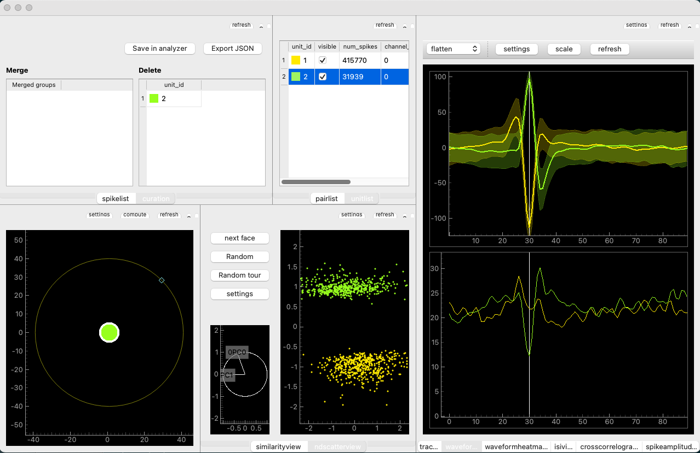

Python code for analyzing hippocampus data

## Installation

### Create a new conda environment

From terminal do

```bash
conda create -n hippocampus python==3.9
conda activate hipoocampus
```

Then, clone this repository, for instance in `~/Documents/python/PyHippocampus`

```bash
cd ~/Documents/python
git clone https://github.com/grero/PyHippocampus.git PyHippocampus
```

Install the requirements

```bash
pip install -r requirements.txt
```

and install the package itself into your python environment

```bash
pip install -e .
```

Clone pyedfread for reading Eyelink files from GitHub to your computer by selecting Clone->Open in Desktop: 

https://github.com/nwilming/pyedfread

or using terminal,


```bash
pip install git+https://github.com/nwilming/pyedfread
```

You should also clone the following two repositories:

```bash
pip install git+https://github.com/grero/DataProcessingTools
pip install git+https://github.com/grero/PanGUI
```

Close the Terminal window, select Home in the sidebar of the Anaconda Navigator window, and launch Spyder. Type the following from the python prompt: 

```python
import PyHippocampus as pyh
```

You should be able to use the functions by doing: 

```python
pyh.pyhcheck('hello')

cd ~/Documents/Python/PyHippocampus

# count number of items in the directory

df1 = pyh.DirFiles()

cd PyHippocampus

# count number of items in the directory

df2 = pyh.DirFiles()

# add both objects together

df1.append(df2)

# plot the number of items in the first directory

df1.plot(i=0)

# plot the number of items in the second directory

df1.plot(i=1)
```

Test to make sure you are able to read EDF files: 
Change to a directory that contains EDF files, e.g.:

```python
cd /Volumes/Hippocampus/Data/picasso-misc/20181105
```

Enter the following command: 

```python
samples, events, messages = edf.pread('181105.edf', filter='all')
```

You can create objects by doing:

```python
rl = pyh.RPLParallel()

uy = pyh.Unity()

el = pyh.Eyelink()
```

You can create plots by doing:

```python
rp = PanGUI.create_window(rl)

up = PanGUI.create_window(uy)

ep = PanGUI.create_window(el)
```

## Spike curation
To manually curate spikes sorted with moutainsort, navigate to a channel directory containing the output from mountainsort, e.g.

```bash
cd /Volumes/Hippocampus/data/picasso-misc/20181105/mountains/channel031
```

Then, from this directory, launch the si_sorting.py script

```bash
si_sorting.py
```

This will open the curation GUI, like this:



In the upper right corner, you can see the mean and standard deviation of the spike shapes assigned to two clusters, while the scatter plot in the middle shows a 2D representation of the feature space for the same clusters. Right above the feature space is a list view of the two clusters, showing the color associated with each cluster Id, and the number of spikes assigned to each cluster. To the left of the cluster list view is another view with title 'Delete'. This view contains a list of the cluster that were rejected as most likely not being neural nature. The green cluster has a a very sharp, positive going waveform which is not the kind of waveform shape we usually see in this kind of data. The yellow cluster has a more traditional shape, though the number of spikes assigned to it is very high. Still, for this example we'll tentatively accept this cluster as a potentially single unit.
To the left of the 'Delete' view is another view with the heading 'Merge'. This is where units that we chose to merge will appear.
To delete a unit, right click on it in the main unit list view and select 'Delete'. To merge two or more units, select them and click 'Merge selected'.
Once we are happy with the result, click 'Save in analyzer' and close the window. This will save the results, which we can then use to create spike trains.